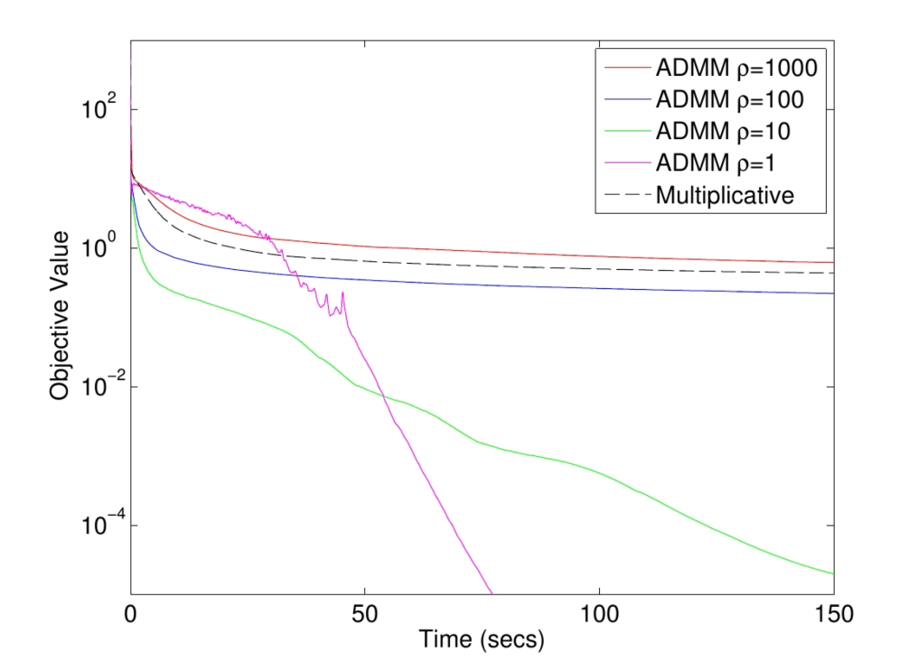

Non-negative Matrix Factorization with Alternating Direction Method of Multipliers   
============================================
A sparsity aware implementation of "Alternating Direction Method of Multipliers for Non-Negative Matrix Factorization with the Beta-Divergence"  (ICASSP 2014).

<div style="text-align:center"></div>
<p align="justify">
  
Non-negative matrix factorization (NMF) is a popular method for learning interpretable features from non-negative data, such as counts or magnitudes. Different cost functions are used with NMF in different applications. We develop an algorithm, based on the alternating direction method of multipliers, that tackles NMF problems whose cost function is a beta-divergence, a broad class of divergence functions. We derive simple, closed-form updates for the most commonly used beta-divergences. We demonstrate experimentally that this algorithm has faster convergence and yields superior results to state-of-the-art algorithms for this problem.</p>

This repository provides a sparsity aware implementation for ADMM based NMF as described in the paper:

> Alternating Direction Method of Multipliers for Non-Negative Matrix Factorization with the Beta-Divergence.
> Dennis L. Sun and Cédric Févotte 
> ICASSP 2014
> [[Paper]](http://statweb.stanford.edu/~dlsun/papers/nmf_admm.pdf)


### Requirements

The codebase is implemented in Python 3.5.2. package versions used for development are just below.
```
tqdm               4.28.1
numpy              1.15.4
pandas             0.23.4
texttable          1.5.0
scipy              1.1.0
argparse           1.1.0
```
### Datasets

The code takes an input matrix from a csv file. Every row indicates a (user, item, value) triplet. Values are separated by commas and the first row is a header. Rows and columns should be indexed starting with 0. A sample matrix for the `Twitch Taiwan` dataset is included in the  `input/` directory. The structure of the matrix is the following:

| **User ID** | **Item ID** | **Positive Value** | 
| --- | --- | --- |
| 0 | 3 |10 |
| 1 | 1 |1 |
| 2 | 2 |12 |
| 3 | 1 |17 |
| ... | ... |... |
| n | m |8 |

### Options

The learning of the embedding is handled by the `src/main.py` script which provides the following command line arguments.

#### Input and output options

```
  --input-path      STR    Input matrix path.       Default is `input/twitch_taiwan.csv`.
  --user-path       STR    Item users path.         Default is `output/twitch_taiwan_user.csv`.
  --item-path       STR    item factors path.       Default is `output/twitch_taiwan_item.csv`.
```

#### Model options

```
  --epochs        INT     Number of training epochs.      Default is 100. 
  --dimensions    INT     Factor dimensions.              Default is 32.
  --rho           FLOAT   Regularization parameter.       Default is 1.0.
```

### Examples

The following commands execute a factorization and save the row and column factors to disk as csv files.

Training an ADMM NMF model on the default dataset. Saving the factors at default paths.
```
python src/main.py
```
<p align="center">

</p>

Creating a model with 128 features.
```
python src/main.py --dimensions 128
```
Creating a model with some custom regularization and epoch number.
```
python src/main.py --rho 10.0 --epochs 100
```
